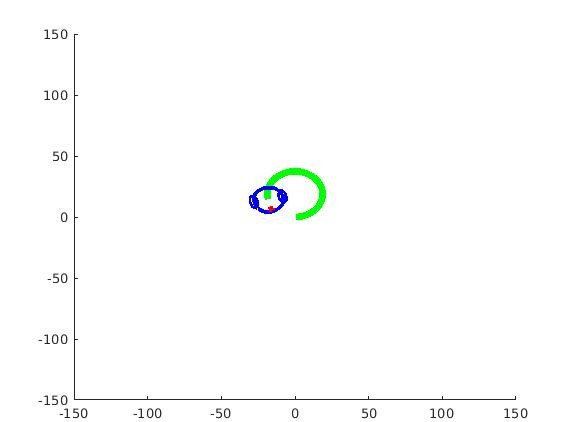
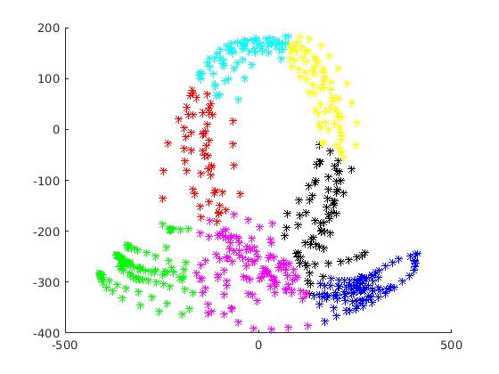
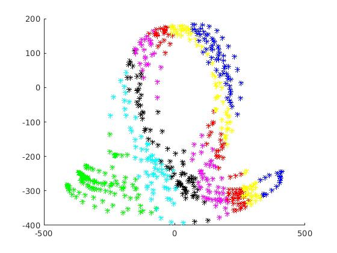
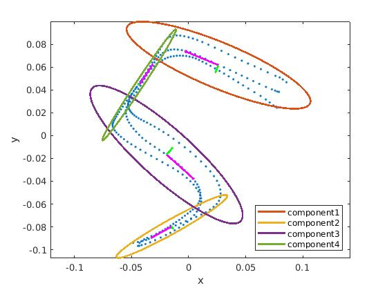
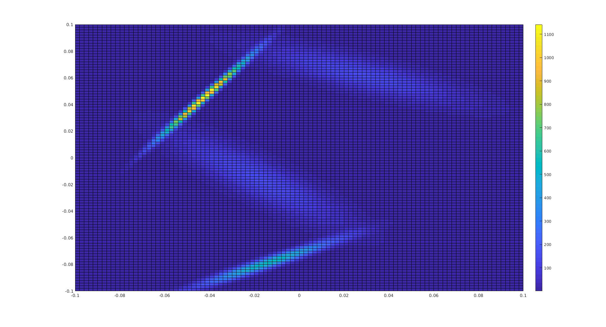
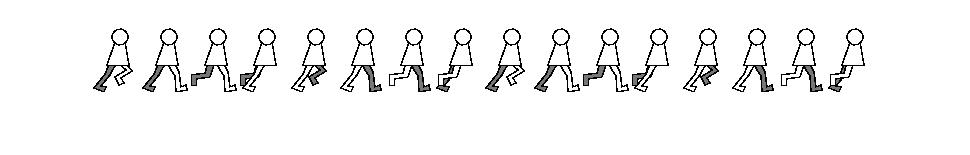

# Machine Learning 
## Part 1
### 1.1 Estimating velocity motion model of a mobile robot through linear regression

The task is to estimate the pose of a mobile robot from control inputs (velocity and angular velocity) through black box modeling regardless of its mathematical model. 

The estimation problem is solved in following steps:

- Apply k-fold cross validation with varying model complexity.
- The model complexity which result in lowest error is selected.
- Re-estimate the model parameters for the selected model complexity using the entire dataset.

    
     
    An example of  robot trajectory simulation using the learned model parameters

### 1.2 Handwritten digits classification using Bayesian classifier with MNIST database

The handwritten digits classification problem is solved in following steps:

- Apply PCA to project the data into a lower dimensional space, to avoid the singularity problem associated with density estimation in high dimensional space. 

- Model the distribution of each digit using a multivariate Gaussian distribution. 
- Assign the input to the class which yields the highest likelihood value.

### 1.3 Human motion clustering

In Learning by Demonstration (LbD) problem, Gaussian Mixture Models (GMM) is widely used to encode demonstrated trajectory, the parameters of which are estimated using Expectation Maximization (EM) algorithm. 

Typically, unsupervised clustering algorithms are use to determine the initial parameters for EM algorithm. Here I implemented two typical clustering algorithm:

- K-means (without using the k-means Matlab function).

  

      
       
      An example of clustering result using K-means Algorithm
  

- Non-Uniform Binary Split Algorithm.

  

      
       
      An example of clustering result using Non-Uniform Binary Split Algorithm. 
  

## Part 2
### 2.1 Learning dataset using Gaussian mixture model

Based on the initial value obtained using k-means algorithm, apply EM algorithm to train a Gaussian Mixture model which encodes the demonstrated trajectory. 

    
     
    Visualization of GMM components. 

    
     
    Visualization of GMM density function. 

### 2.2 Human gesture recognition using hidden Markov model

The task is to determine the likelihood that a particular sequence of observations was generated by the given model and classify the gesture based on the obtained likelihood value.

The likelihood is determined through forward procedure, which reaches high  computation efficiency. 

### 2.3 Learning gait pattern for a humanoid robot using Reinforcement Learning

The aim of the task is to control a mobile robot so that it moves forward with a reasonable walking pattern without the help of Matlab toolbox. Two sub-tasks are implemented:

- Assume full knowledge of the Markov decision process (MDP), apply policy iteration to learn the optimal policy.

- Without any prior knowledge to environment, apply Q-learning to learn the optimal policy.

  

      
       
      An example of the learned walking pattern. 
  

